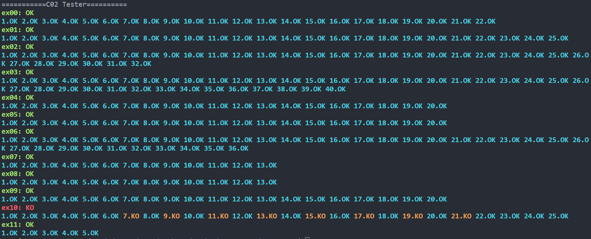
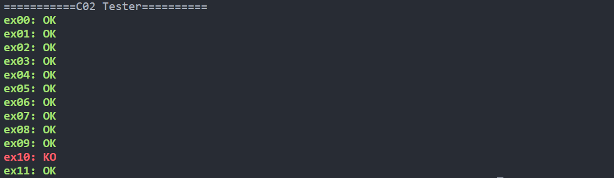
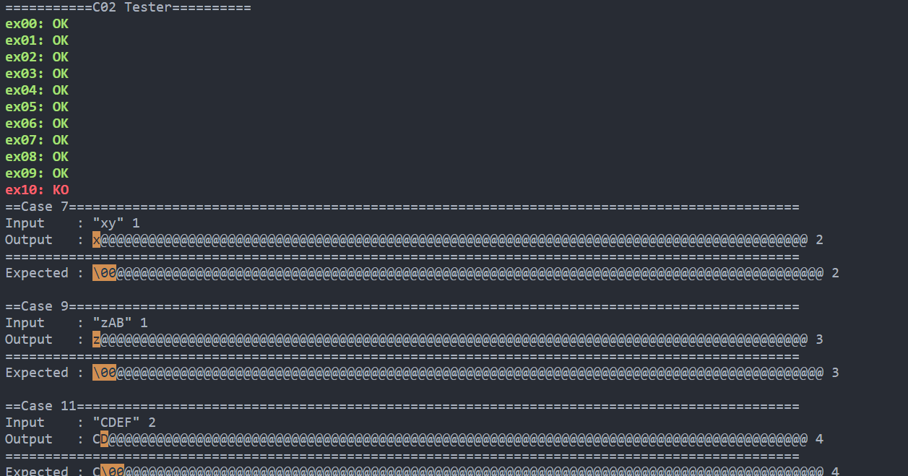

# c_piscine_tester

Tester for assignments in 42 c piscine

## Introduction

This C++ tool tests C files for assignments in the C piscine. It creates a temporary main file if needed, compiles the tested files, and run tests using command-line arguments (argv). The program then reads and compares the output against expected results.

## Features

- Comprehensive test cases covering edge scenarios.
- Meticulously designed flags for different display modes.
- User-friendly UI to pinpoint test case failures.

## Update

go to `c_piscine_tester`, run

```bash
make pull
```

## Getting Started

### Installation

To get started, run the following commands in your terminal:

```bash
git clone https://github.com/stanX19/c_piscine_tester.git c_piscine_tester
cd c_piscine_tester
git clone https://github.com/stanX19/CTest CUnitTest
```

### Initialization

1. Cd into the the tester you are interested in, e.g. "C00tester"

```bash
cd C00tester
```

2. compile the binary executable

```bash
make
```

3. run the binary executable

```bash
./C00tester -h
```

4. You will see a usage message; take the time to read through it; it is not an error.

You are now ready to test your project. For refernce, go to [Usage](#usage)

To run another tester, repeat from [step 1](#Initialization)

### Usage

#### Basic usage:

```
[name] [target_directory]
```

Runs tests on the specified target directory, which should contain files to be tested (e.g., `ex00`, `ex01`).

If not specified, the tester will assume the current working directory is the target directory. You can place the tester inside the tested directory for convenience.

#### flags

There are several flags available to change the displayed information.

 - `-l` : List - Display test case status
 - `-a` : All - Display all test cases
 - `-f` : Fail - Display only failed test results
 - `-d` : Detail - Display test cases in detail

 - `--sn` : Silence Norm - ignore norm errors

You can combine the flags to achieve a dynamic combination of options:

 - `-ad`  : All Detail - Display all test cases in detail
 - `-af`  : All Fail - Display all failed test cases
 - `-fd`  : Fail Detail - Display *first* failed test case in detail
 - `-afd` : All Fail Detail - Display all failed test cases in detail

Example:
 - `[name]`
 - `[name] -l`
 - `[name] -afd`

	
	
	

#### Test case display format

Unprintable characters are converted into hexadecimal representations, displayed in cyan for differentiation.

Differences between the actual output and the expected output are highlighted in yellow.

#### Termination

In case you want to terminate the program, hold `ctrl + c`

you can remove residual temporary files by executing the following command:

`find . -name "temp*" type f -print -delete`

**WARNING** all files prefixed with "temp" will be deleted.

## linkage

CUnitTest: https://github.com/stanX19/CTest